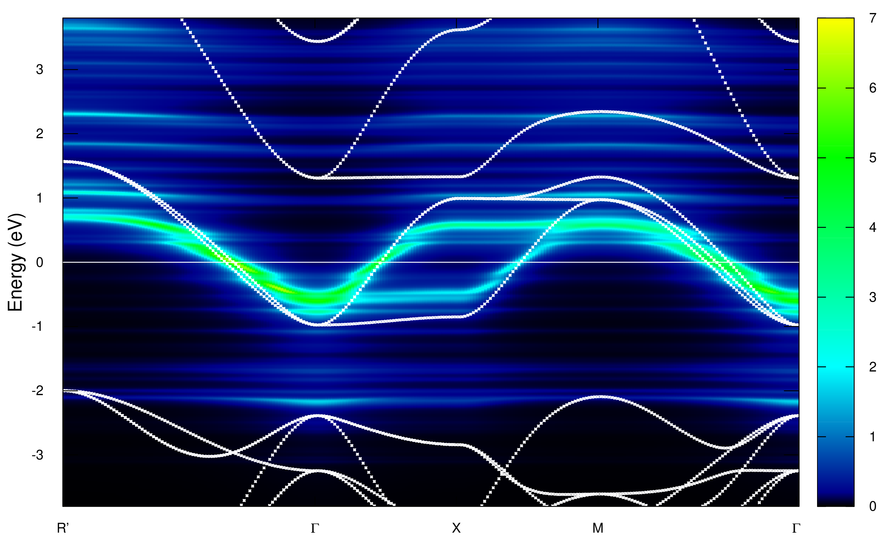

# abinit_DMFT_interface

This is an interface between Abinit and any external impurity solvers that support python interface, like [EDIpack](https://github.com/QcmPlab/EDIpack) (an exact diagonalization impurity solver) and the TRIQS impurity solver family, including [CTHYB](https://triqs.github.io/cthyb/latest/) and [Hubbard-I](https://triqs.github.io/hubbardI/latest/), etc. Currently only support calculations without SOC and spin polarization. The generalization to spin-polarized case is easy and on-going. Here we present two examples on the interface with EDIpack (`SrVO3_EDIpack/`) and Hartree-Fock impurity solver (`FeSe_HF/`).
			
The structure of the interface is similar to `dmft_solv = 9` ([python invocation](https://docs.abinit.org/variables/dmft/#dmft_solv)) mode in Abinit. We have fixed some bugs and made it simpler and more efficient compared with its [original implementation](https://github.com/abinit/abinit/blob/master/src/68_dmft/m_forctqmc.F90#L2425). Details of the modifications can be found [here](https://github.com/LongXuanyu/abinit/commit/b34fdadd365e9b2a778a14414d1c29fddde48356). Some codes in the python scripts `test.py` and `tools.py` are modified from [DCore](https://github.com/issp-center-dev/DCore) and [TRIQS](https://triqs.github.io/triqs/latest/). 

### Dependencies
* Replace 5 files in the source code of Abinit  9.6.2 by the modified files provided in `abinit_patch/`. Compile the modified Abinit with flag `enable_python_invocation="yes"`. 
* An external impurity solver that supports python interface
* [TRIQS 3.x](https://triqs.github.io/triqs/latest/install.html) 
* [mpi4py](https://pypi.org/project/mpi4py/)
* [netCDF4 for python](https://pypi.org/project/netCDF4/)

### How to run the tests
* Run Abinit as usual with the provided input files. Note that we must set `dmft_solv = 2` and the python script `test.py` must be present in the calculation directory. 
* In order to plot the spectral function A(k,w), please follow the instructions in [Abinit DMFT tutorial](https://docs.abinit.org/tutorial/dmft/#7-electronic-structure-of-srvo3-k-resolved-spectral-function). The file `SVOi_DS3Self_ra-omega_iatom0001_isppol1` that contains the self energy on real frequency axis must be provided. For EDIpack impurity solver, we can use `sigmaw.py` to generate it. The header and footer of the file should be copied and modified from `SVOo_DS2Self-omega_iatom0001_isppol1`.

